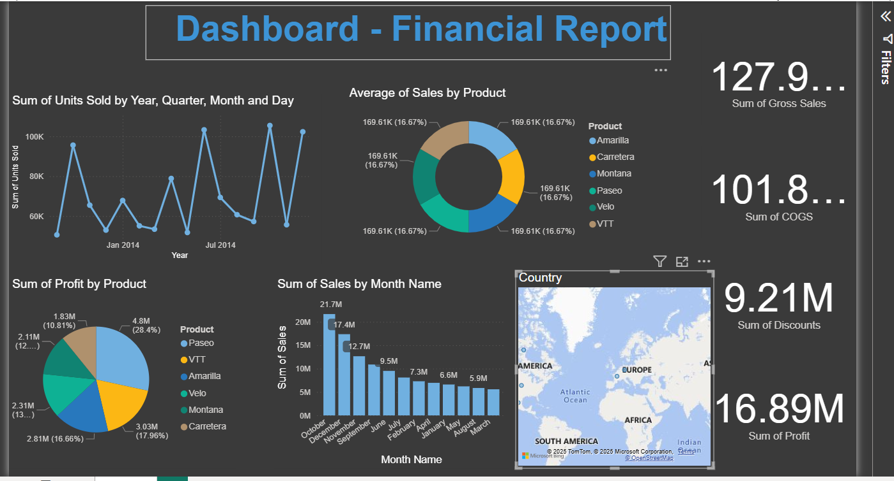

# 📊 Financial Sales Dashboard – Power BI

## 📌 Overview
This project features an interactive **Financial Sales Dashboard** built using **Power BI** to analyze global sales performance.  
It enables decision-makers to track revenue trends, understand product-wise profitability, and compare sales across regions and time periods.

---

## 📸 Dashboard Preview

  

---

## 🎯 Business Purpose
The dashboard helps stakeholders:
- Monitor **overall financial performance**
- Identify **top & low-performing products**
- Track **yearly, quarterly & monthly revenue**
- Analyze **sales contribution by region**
- Improve **data-driven decision making**

---

## 🔍 Key Insights from the Dashboard
- **Gross Sales:** 127.9M  
- **COGS:** 101.8M  
- **Discounts:** 9.21M  
- **Profit:** 16.89M  

Additional observations:
- **Paseo** recorded the **highest total profit**
- **October** was the **best month in sales**
- Strong geographic performance in **North America and Europe**

---

## 🧾 Dataset Description
| Attribute | Details |
|----------|---------|
| Dataset Type | Financial Sales |
| Format | Excel (.xlsx) |
| Contains | Product, region, customer & order details |
| Key Metrics | Units sold, revenue, discounts, COGS & profit |

---

## 🛠 Tools & Technologies Used
| Technology | Purpose |
|-----------|---------|
| Power BI Desktop | Data visualization & dashboard building |
| Power Query | Data cleaning & transformation |
| DAX | Business logic & calculated measures |
| Excel | Data source |

---

## 📁 Repository Structure
Financial-Sales-Dashboard/
│── Financial_Sales1.pbix
│── Financial_Dataset.xlsx
│── dashboard_preview.png
│── README.md

---

## 🚀 Future Enhancements
- Add forecasting for profit & revenue
- Provide customer segmentation view
- Publish dashboard online with Power BI Service

---

## 👤 Author
**Abhi – Power BI Developer & Data Analyst**  
📧 Passionate about Data Visualization | Business Insights | Dashboards

If you found this project useful, please ⭐ star the repository!

